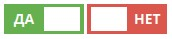

# karelwintersky/smarty.plugin.optionswitcher

Класс-плагин к Smarty, обеспечивающий в шаблонах работу с переключателями вида:



Эта версия проверенно работает со Smarty 3+

# Использование

```php
composer require __DIR__ . '/vendor/autoload.php';

$SMARTY = new Smarty();
\Arris\Plugin\OptionSwitcher::register($SMARTY);
```

Теперь мы можем использовать в шаблонах вызов класса:

```php
{OptionSwitcher::html('switch_debug_mode', 'is_debug_mode_active')}
```

Но простой вызов ничего не даст, если не прописать стили. Их можно взять из README ниже или тоже вставить в шаблон вызовом:

```php
{OptionSwitcher::css()}
```
Этот вызов нужно делать ВНЕ блока `<style></style>` (т.к. описание классов переключателя уже обёрнуто тегом style). 

После этого переключатель уже будет работать. Но чтобы дать ему функциональность, нужно сделать еще две штуки:

1. описать JS-обработчик

Минимально он задается тоже вызовом 
```php
{OptionSwitcher::js()}
```
... и тоже уже обёрнут в `<script></script>`. 

2. Пробросить в шаблон переменную с именем из второго аргумента вызова `{OpenSwitcher:html()}` - из неё код переключателя возьмет статус переключателя - ВКЛ / ВЫКЛ.

```php
$smarty->assign("is_debug_mode_active", getCurrentDebugModeState() ); // 0 или 1 
```

Теперь рассмотрим подробнее параметры вызова метода `html()`. Полная спецификация метода выглядит так:

```php
html(
    string $switcher_id = '',                   // имя-идентификатор переключателя, передается на бэк в обработчик 
    string $exposed_smarty_variable = '',       // имя пробрасываемой в шаблон Smarty переменной, содержащей актуальное состояние переключателя
    bool   $is_enabled = true,                  // включен ли переключатель? (значение false ставит input'у атрибут disabled) 
    string $on_text = 'ДА',                     // надпись на переключателе, когда он имеет состояние 1  
    string $off_text = 'НЕТ',                   // надпись на переключателе, когда он имеет состояние 0
    string $css_tuning_class = '',              // имя кастомного CSS-класса для раскраски переключателя.
    string $request_uri = ''): string           // кастомный коллбэк для этого переключателя
```


# Под капотом

Этот переключатель реализован через HTML-код:

```html

Отладочный режим: 
<input class="switcher action-option-switcher" id="switcher-debug" type="checkbox">
<label for="switcher-debug" data-text-true="ДА" data-text-false="НЕТ"><i></i></label>
```

Блок CSS-стилей:

```css
input.switcher[type=checkbox] {
    display: none;
}

input.switcher[type=checkbox] + label {
    display: inline-block;
    background-color: #DB574D; /* $off_color */
    color: white;
    font-family: sans-serif;
    font-size: 14px;
    font-weight: bold;
    height: 30px;
    line-height: 30px;
    position: relative;
    text-transform: uppercase;
    width: 80px; /* $width */
}

input.switcher[type=checkbox] + label,
input.switcher[type=checkbox] + label i {
    -webkit-transition: all 200ms ease;
    -moz-transition: all 200ms ease;
    -o-transition: all 200ms ease;
    transition: all 200ms ease;
}

input.switcher[type=checkbox]:checked + label {
    background-color: #67B04F; /* $on_color */
}

input.switcher[type=checkbox] + label:before,
input.switcher[type=checkbox] + label:after,
input.switcher[type=checkbox] + label i {
    width: 50%;
    display: inline-block;
    height: 100%;
    text-align: center;
}

input.switcher[type=checkbox] + label:before {
    content: attr(data-text-true);
}

input.switcher[type=checkbox] + label:after {
    content: attr(data-text-false);
}

input.switcher[type=checkbox] + label i {
    top: 10%;
    background-color: white;
    height: 80%;
    left: 5%;
    position: absolute;
    width: 45%;
}

input.switcher[type=checkbox]:checked + label i {
    left: 50%;
}

input.switcher[type="checkbox"] + label[data-disabled*="disabled"] {
    background-color: #acacac !important;
}
```

И обвязку на jQuery:

```js
 $(document).ready(function (){
     $(".action-option-switcher").on('change', function(){
         let switcher = $(this).prop('id');

         let new_state = $('#' + switcher).is(':checked') ? 1 : 0;

         let url = $(this).data('url') || '{$uri}';

         $.ajax({
             url: url,
             method: "POST",
             data: {
                 switcher: switcher,
                 new_state: new_state
             }
         });

     });
 });

```

Это все реализовано через механизм https://www.smarty.net/docs/en/api.register.class.tpl - мы дёргаем статический метод зарегистрированного класса, передавая ему параметры.
